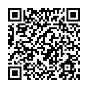

# Freddy the bot  
LINE上的自我介紹機器人  
  
## 功能介紹  
- #### 一對一聊天功能  
	機器人能夠回答以下問題，當使用者輸入的問題中包含多個關鍵字時，機器人會根據關鍵字逐一回覆  
	1. 基本問候  
		能夠回應你好、再見等基本的問候  
		- 說明：  
		當訊息中出現"Hi"、"Hello"、"你好"、"嗨"、"哈囉"其中之一時，機器人會隨機挑選一句問候語回覆  
		當訊息中出現"Bye"、"掰掰"、"再見"其中之一時，機器人會隨機挑選一句道別語回覆  
	2. 我是誰  
		簡單的介紹自己  
		- 說明：  
		當訊息中出現"你是誰"時，機器人會做簡單的自我介紹  
	3. 學經歷相關問題  
		能夠回答學歷的問題  
		- 說明：  
		當訊息中出現"學歷"、"學校"、"就讀"、"大學"、"研究所"其中之一時，機器人會回覆學歷資訊  
	4. 實習相關問題  
		能夠回答實習的問題  
		- 說明：  
		當訊息中出現"工作"、"實習"其中之一時，機器人會回覆實習及工作經驗的相關資訊  
	5. 程式設計相關問題  
		能夠回答程式語言的問題  
		- 說明：  
		當訊息中出現"程式"、"用"其中之一，而且訊息中有"語言"時，機器人會回答會使用的程式語言  
	6. 履歷分享  
		能夠分享履歷連結  
		- 說明：  
		當訊息中出現"履歷"、"簡歷"、"自傳"其中之一時，機器人會傳送履歷連結給使用者  
	7. 興趣  
		描述興趣及分享作品  
		- 說明：  
		當訊息中出現"興趣"時，機器人會分享興趣及作品連結給使用者  
	8. 使用說明  
		顯示使用說明的連結以及基本的使用範例  
		- 說明：  
			當訊息中出現"使用"，並同時出現"說明"、"方式"其中之一時，機器人會顯示內含說明及可以呼叫範例的Button  
	9. 使用範例  
		顯示一些常用的問題，幫助使用者了解使用方式  
		- 說明：  
		當訊息中出現"使用"，並同時出現"範例"時，機器人會顯示內含說明的Carousel  
	10. 聯絡方式  
		提供email讓使用者能夠聯絡  
		- 說明：  
		當訊息中出現"聯絡"時，機器人會提供使用者聯絡的email  
	11. 圖文選單  
		提供使用者圖文選單，方便使用者快速上手  
	12. 貼圖  
		使用者傳送貼圖時，機器人會回覆熊大貼圖  
	13. 其他  
		告知使用者目前無法回答此類問題，並傳送貼圖  
	
	**實驗中功能：**
	在維基百科上搜尋相關條目
	- 說明：  
	輸入"維基 [想要搜尋的條目]"機器人會回覆該條目的概要，如果沒有符合的結果，機器人也會告知使用者
  
- #### 群組聊天功能  
	1. 邀請好友
		- 說明：  
		當機器人收到群組邀請後會加入群組，留下連結及QRcode邀請大家加自己為好友，完成留言後便會離開群組  
